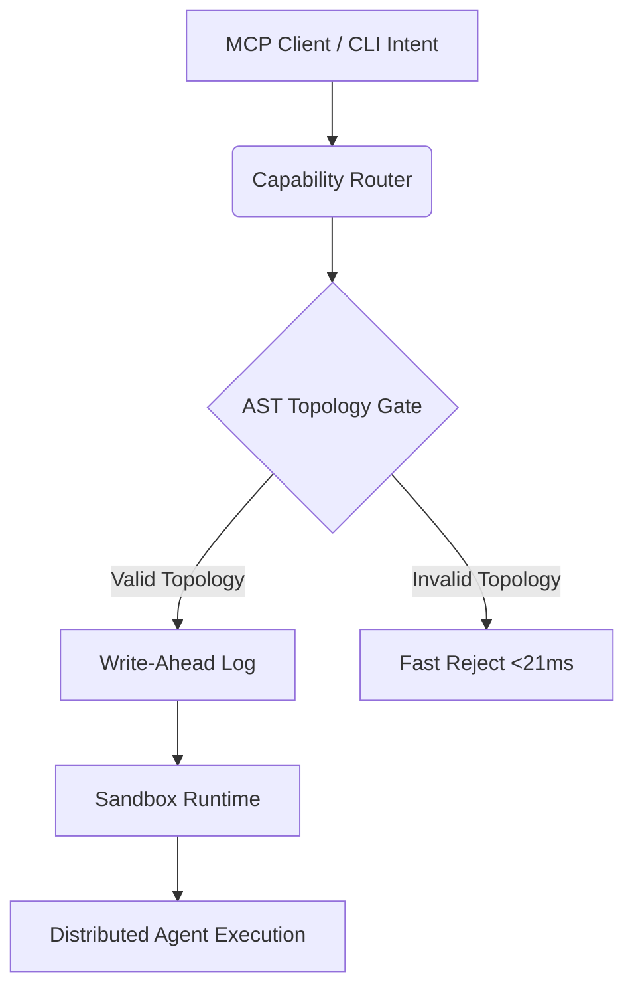

<div align="center">
  <h1>⚙️ Skillbrary</h1>
  <p><strong>The Enterprise-Grade Distributed Swarm Toolkit</strong></p>

  <p>
    <a href="https://github.com/axton/skillbrary/actions"></a>
    <a href="https://python.org"></a>
    <a href="https://github.com/axton/skillbrary/blob/main/LICENSE"></a>
    <a href="https://github.com/axton/skillbrary/issues"></a>
  </p>
</div>

<hr/>

Skillbrary is a high-performance skill registry and execution layer specifically architected for **distributed multi-agent swarms**. It abandons traditional, slow context-stuffing in favor of strict concurrency, deterministic execution, and ultra-low latency hardware bounds (`<100ms`).

## 📖 Table of Contents
- [The Architecture of Intelligence](#-the-architecture-of-intelligence)
- [Core Features](#-core-features)
- [Quick Start](#-quick-start)
- [System Architecture](#-system-architecture)
- [Project Structure](#-project-structure)
- [Contributing](#-contributing)
- [License](#-license)

## 🧠 The Architecture of Intelligence

Traditional LLM agent frameworks fail at scale. By "slurping" entire codebases into context windows, they suffer from $O(N^2)$ attention collapse, causing massive token blowout and hallucinated syntax. 

**Skillbrary solves this.** 
We utilize a native Write-Ahead Logging (WAL) paradigm and surgical Abstract Syntax Tree (AST) extractions to ensure your Swarm interacts with structural topology—not raw text.

## ✨ Core Features

| Feature | Description | Latency Bound |
| :--- | :--- | :--- |
| **WAL-Driven Execution** | Uses `msvcrt` FileLock protocols to guarantee atomic file appending and state isolation across multiple agents without `os.fsync` blocking. | `< 10ms` |
| **Lightweight AST Parsing** | Eliminates context bloat by parsing class/function topologies directly via AST. Includes a `FAST_REJECT_REGEX` pre-filter. | `< 21ms` |
| **Topological DAG Execution** | Built-in Decompositor sorts tasks into a strict Directed Acyclic Graph (DAG) for isolated, decoupled routing. | `< 50ms` |
| **Secure Sandbox Runtimes** | Executes tasks in natively branched workspaces with full environmental purges post-execution to prevent context contamination. | `Isolated` |

## 🚀 Quick Start

Ensure you have [uv](https://github.com/astral-sh/uv) installed, as Skillbrary relies on strict, fast dependency resolution.

```bash
# 1. Clone the repository
git clone https://github.com/axton/skillbrary.git
cd skillbrary

# 2. Sync dependencies using uv
uv sync

# 3. Boot the unified CLI / MCP Intent Parser
uv run python src/main.py --help
```

## 🏗 System Architecture

Skillbrary acts as the physical router and gatekeeper for autonomous intents. 



## 📁 Project Structure

Skillbrary enforces a clean, modular hierarchy:

```text
skillbrary/
├── src/
│   ├── registry/           # WAL execution driver and lock manager
│   ├── evaluator/          # Optimized AST topography scanner
│   ├── router/             # Low-latency bulk action resolver
│   ├── runtime/            # Branch-based workspace isolation module
│   └── main.py             # Unified CLI and MCP intent parser
├── tests/                  # Deterministic test isolation bounds
├── pyproject.toml          # uv-compliant dependency graph
└── uv.lock                 # Strict dependency pinning
```

## 🤝 Contributing

We welcome structural improvements that align with deterministic execution paradigms. Please read our [CONTRIBUTING.md](CONTRIBUTING.md) for details on our code of conduct, PR process, and strict hardware-latency constraints.

## 🛡 Security

If you discover any security vulnerabilities, please refer to our [SECURITY.md](SECURITY.md) policy for responsible disclosure guidelines.

## 📄 License

This project is licensed under the Personal Use License - see the [LICENSE](LICENSE) file for details. Copyright (c) 2026 Axton Carroll.
