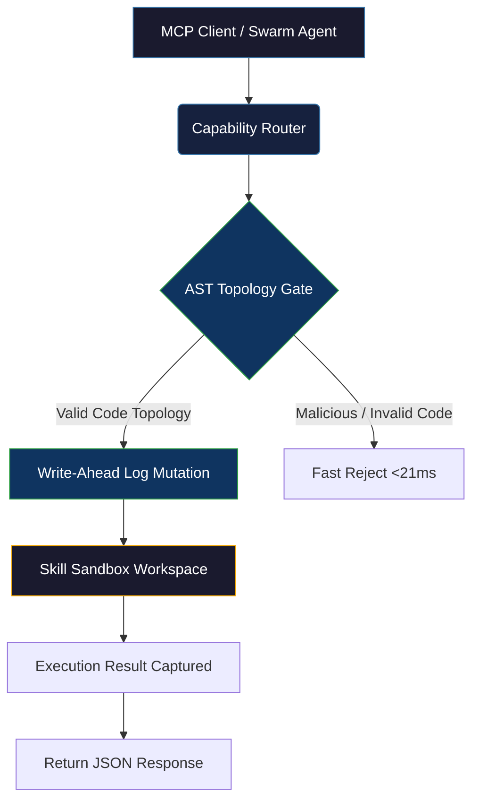

<div align="center">
  
</div>

<br>

<div align="center">

[](https://github.com/axtontc/The-Skillbrary/releases)
[](https://python.org)
[](LICENSE)
[](https://github.com/axtontc/The-Skillbrary/actions)

</div>

<br>

<h1 align="center">⚙️ The Skillbrary — Low-Latency Registry for Agent Swarms</h1>

<p align="center">
  <strong>An enterprise-grade, distributed swarm registry and execution environment natively implementing the Model Context Protocol (MCP). Replaces traditional slow, context-stuffed prompts with isolated, secure sandboxing and structural Abstract Syntax Tree (AST) routing.</strong>
</p>

<p align="center">
  <a href="#-quick-start">Quick Start</a> •
  <a href="#-mcp-integration-cursor--claude">MCP Connection</a> •
  <a href="#-the-architecture-of-intelligence">Architecture</a> •
  <a href="#-http-api-endpoints">HTTP API Reference</a> •
  <a href="#-mcp-tool-reference">MCP Tools</a> •
  <a href="#-contributing">Contributing</a>
</p>

---

## 🧠 The Architecture of Intelligence

Traditional LLM agent frameworks fail at scale. By "slurping" entire codebases and APIs into prompt context windows, they suffer from $O(N^2)$ attention collapse, causing massive token blowout, high inference costs, and hallucinated function calls.

**Skillbrary solves this.** 
We provide a dedicated execution gateway utilizing a Write-Ahead Log (WAL) mutation ledger, custom cross-process concurrency file locks, and surgical Abstract Syntax Tree (AST) extractions. Your Swarm interacts with structural topology—not raw text.

---

## ✨ Core Features

| Feature | Description | Latency Bound |
|:---|:---|:---|
| **WAL-Driven Execution** | Guarantees atomic file appending and state isolation across multiple agents using custom `lock_manager` protocols. | **`< 10ms`** |
| **Lightweight AST Parsing** | Parses class and function topologies directly via AST to eliminate context bloat. Includes a `FAST_REJECT_REGEX` pre-filter. | **`< 21ms`** |
| **Topological DAG Execution** | Built-in capability router automatically resolves tags and sorts tasks into a strict Directed Acyclic Graph (DAG) for isolated routing. | **`< 50ms`** |
| **Secure Sandbox Runtimes** | Executes tasks in natively branched workspaces with full environmental purges post-execution to prevent context leaks. | **Isolated** |

---

## ⚡ Quick Start

### Prerequisites
- **Python 3.11+**
- **uv** (recommended for rapid dependency syncing)

### 1. Clone & Setup
```bash
git clone https://github.com/axtontc/The-Skillbrary.git
cd The-Skillbrary

# Sync virtual environment using uv (fastest)
uv sync

# Or using pip
python -m venv .venv
.venv/Scripts/activate  # On Windows
source .venv/bin/activate  # On Linux/macOS
pip install .
```

### 2. Verify with the Test Suite
Ensure the registry works out-of-the-box (including HTTP API client tests):
```bash
# Run unit and integration tests
uv run python -m pytest tests/test_integration.py -v
```

---

## 🔌 MCP Integration (Cursor & Claude)

The Skillbrary exposes a unified **FastMCP** server that runs over standard I/O (`stdio`) and lazily spawns the registry API server in the background.

### 1. Claude Desktop Config
Add the following to your `claude_desktop_config.json`:

```json
{
  "mcpServers": {
    "skillbrary": {
      "command": "uv",
      "args": [
        "--directory",
        "C:/absolute/path/to/The-Skillbrary",
        "run",
        "python",
        "skillbrary_mcp.py"
      ]
    }
  }
}
```

### 2. Cursor IDE Config
1. Navigate to **Settings** → **Features** → **MCP**.
2. Click **+ Add New MCP Server**.
3. Fill out the configuration:
   - **Name**: `skillbrary`
   - **Type**: `command`
   - **Command**: `uv --directory "C:/path/to/The-Skillbrary" run python skillbrary_mcp.py`
4. Click **Save**.

---

## 🏗 System Architecture



---

## 🌐 HTTP API Endpoints

When started (or lazy-loaded by the MCP client), Skillbrary hosts a local REST API server at `http://localhost:8080` exposing the following:

- **`GET /skills/search?intent={query}&limit={n}`**: Returns all available local and external skills matching the intent or tags.
- **`POST /skills/install`**: Registers a new skill in the index.
  - JSON payload: `{"intent": "...", "skill_id": "..."}`
- **`POST /skills/execute`**: Executes the specified skill dynamically in the sandbox.
  - JSON payload: `{"intent": "...", "skill_id": "...", "script_path": "...", "args": []}`

---

## 🛠 MCP Tool Reference

Skillbrary automatically registers these tools with your agent:

* **`search_skills`**: Searches external registries for agentic capabilities.
* **`install_skill`**: Installs a skill to the local agent toolbox to make it permanently available.
* **`execute_skill`**: Dynamically runs a skill's execution scripts inside the secure Sandbox runtime.

---

## 🔗 Related Projects

Skillbrary belongs to a suite of interconnected AI agent utilities:

| Project | Description |
|---|---|
| [AUI](https://github.com/axtontc/AUI) | Zero-latency cross-process UI automation for Windows and Web |
| [MemMCP](https://github.com/axtontc/MemMCP) | Deterministic memory server with SQLite WAL and FAISS RRF |
| [The-Nexus](https://github.com/axtontc/The-Nexus) | Monolithic API gateway and orchestrator for local LLMs |
| [Fractal-Swarm-v2](https://github.com/axtontc/Fractal-Swarm-v2) | Mathematically optimal state-machine agent swarm orchestration |
| [AntiMem](https://github.com/axtontc/AntiMem) | Memory daemon and compactor for Antigravity swarms |
| [OmniMem](https://github.com/axtontc/OmniMem) | PostgreSQL hybrid memory system for large enterprise swarms |

---

## 📜 License

This project is licensed under the Personal Use License. See the [LICENSE](LICENSE) file for details. Copyright (c) 2026 Axton Carroll.

---

<div align="center">
  <br>
  <strong>⭐ If the Skillbrary makes your multi-agent swarms more modular, consider giving it a star!</strong>
  <br>
  <br>
  <a href="https://github.com/axtontc/The-Skillbrary">
    
  </a>
  <br>
  <br>
  <sub>Built by <a href="https://github.com/axtontc">Axton Carroll</a> — "Nothing is impossible, we merely don't know how to do it yet."</sub>
</div>
